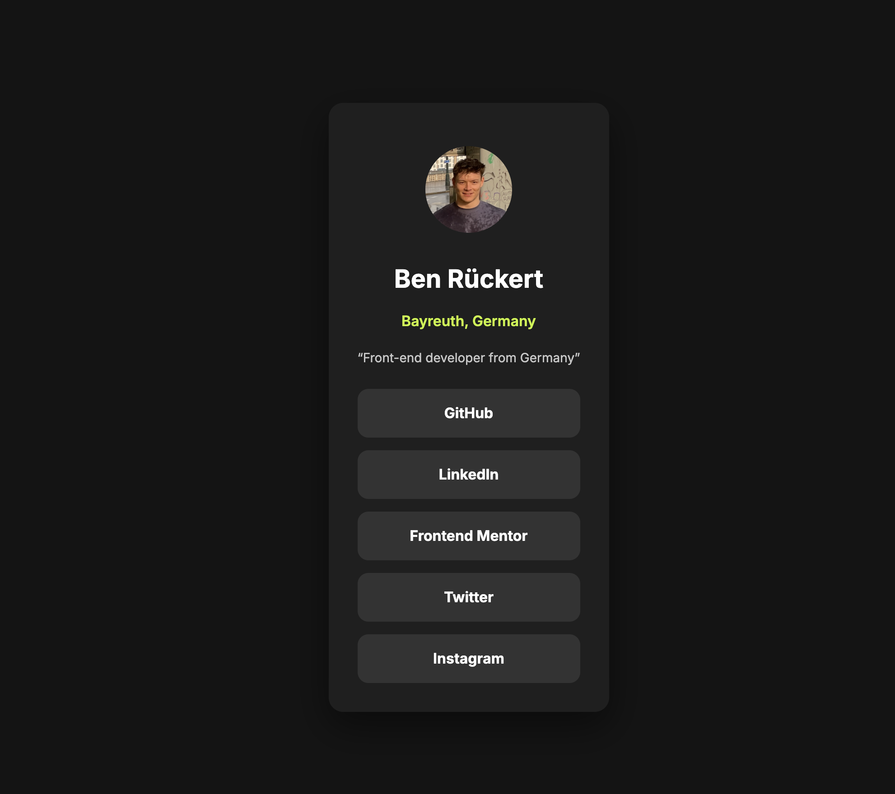

# Social links profile

## Table of contents

- [Overview](#overview)
  - [Screenshot](#screenshot)
  - [Links](#links)
- [My process](#my-process)
  - [Built with](#built-with)
- [Author](#author)

## Overview

### Screenshot

### Links

- Solution URL: [click here:](https://www.frontendmentor.io/challenges/social-links-profile-UG32l9m6dQ)
- Live Site URL: [click here:](https://social-links-profile-1vvy.vercel.app/)

## My process

### Built with

- Semantic HTML5 markup
- CSS custom properties
- Flexbox
- CSS Grid
- Git
- Vercel

## Author

- Ben Rückert